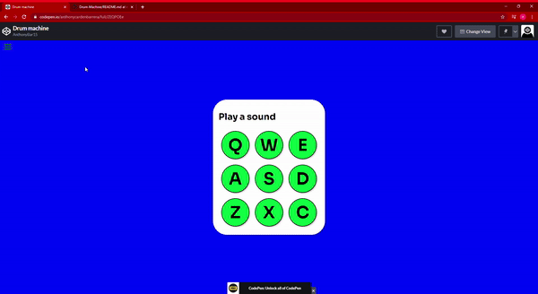

# Drum-Machine

## What I created

This is a react drum machine. The purpose of this app is was to test my knowledge on react components and to create a machine that plays different sounds based on the key that is clicked.

## What I learned

* How to use React components.
* How to follow documentation.
* Learn how to play audio sounds.
